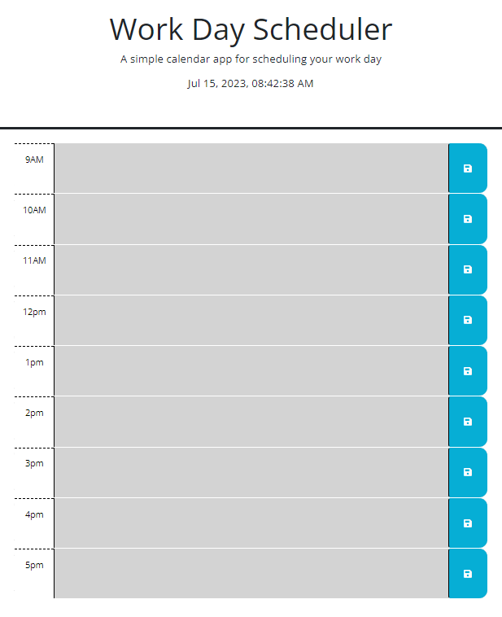

# Work Day Scheduler

## Description
A calendar app for scheduling your work day and to keep track of your daily tasks, from 9am-5pm! 

## Installation

N/A

## Usage
Input your activity goals or deadline in the coressponding hour between 9am-5pm. Then click saved, the blue button on the right. Your files will be saved in local storage, so you will not lose any information when closing the web browser!  
* Current hour is reflective as Red-highlighted Background. 
* Past hours are reflective as Gray-highlighted area.
* Future hours are reflective as Green-highlighted area.  

## Credits

N/A

## License
Please refer to the LICENSE in the repoa

## Links: 

github resipoitory link: https://github.com/s0m3y3/WorkDayScheduler/tree/main

website link: https://s0m3y3.github.io/WorkDayScheduler/
